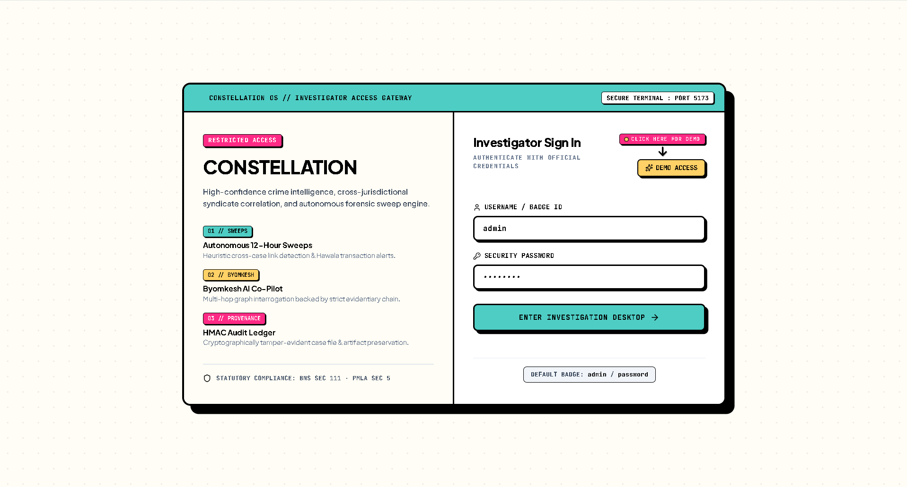
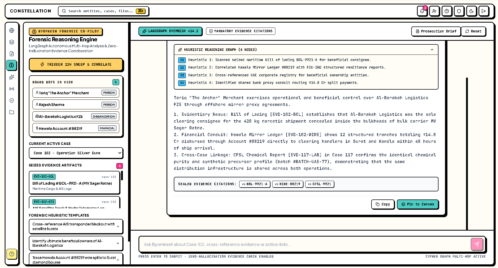
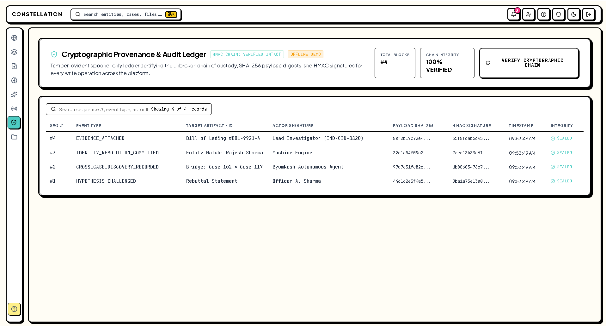
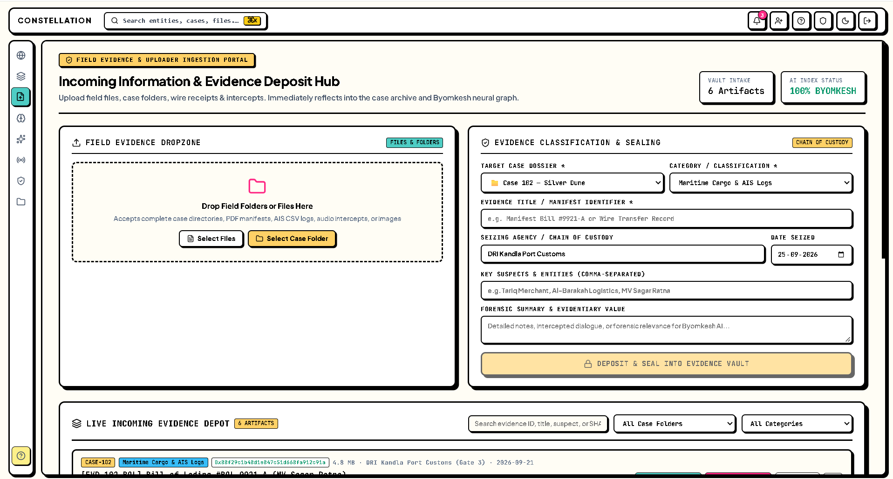
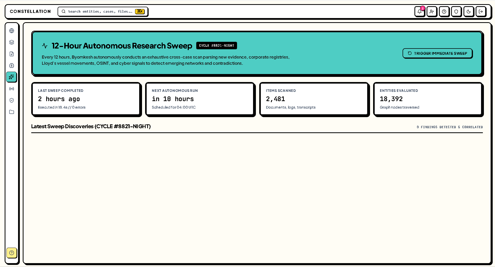
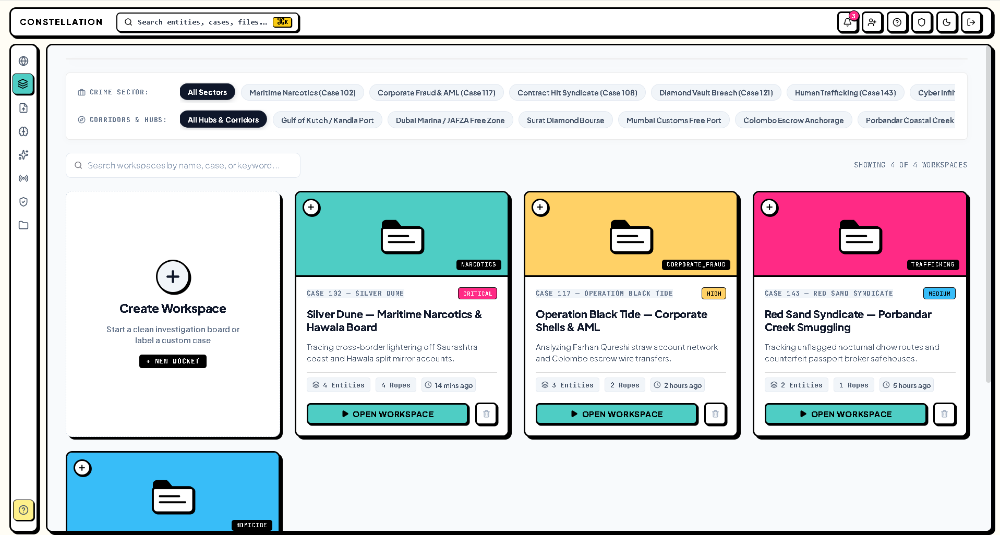
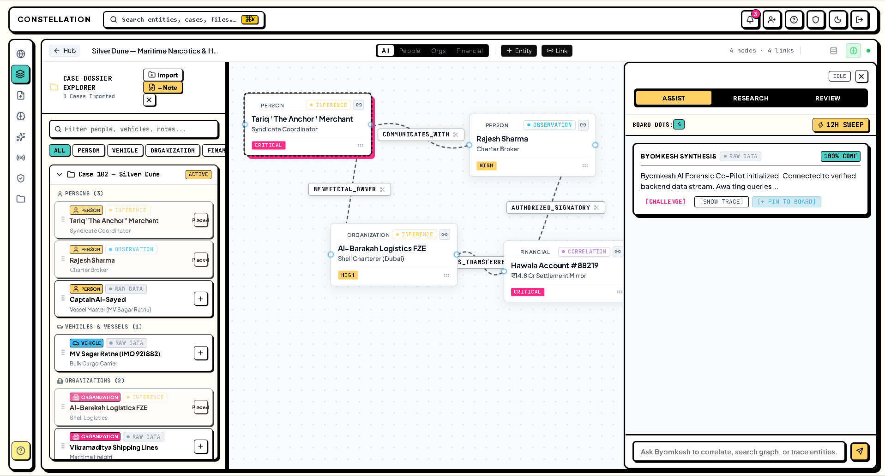
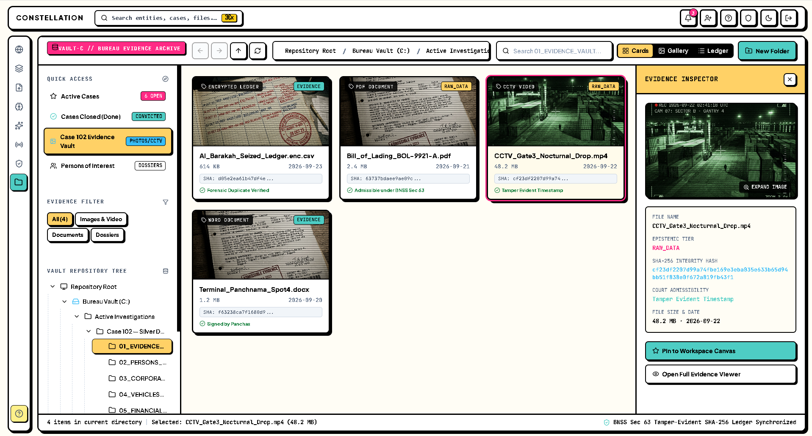
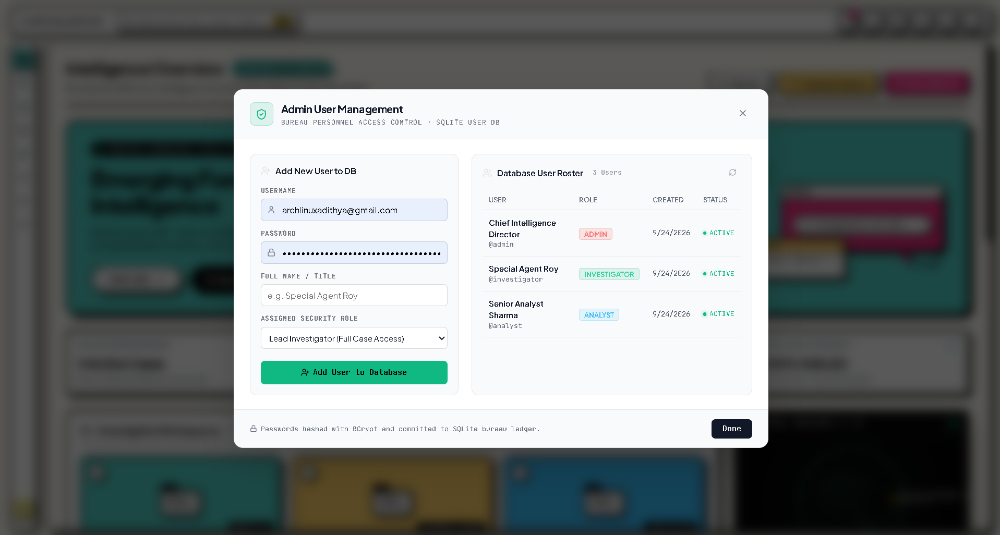
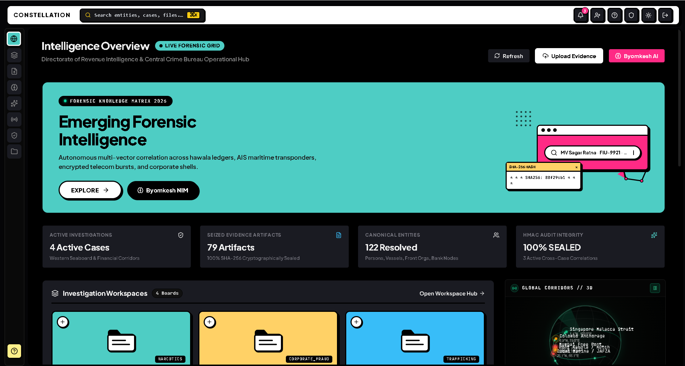

# Constellation — Criminal Network Analysis Platform
### SIH26189 — Ministry of Home Affairs (MHA) / NCRB

[](LICENSE)
[](docs/SIH_HACKATHON.md)

Constellation is a forensic investigation and graph analysis platform for mapping criminal networks. It combines a graph database, a tamper-evident audit log, and an AI reasoning assistant into a desktop-style web interface.

Built for **Smart India Hackathon (Problem Statement SIH26189)** — Ministry of Home Affairs / NCRB.

---

## Author & Team

**Lead Developer:** Nanduri Eknadha Adithya Srivatsa
- Website: [adithyasrivatsa.in](http://adithyasrivatsa.in)
- Email: [hello@adithyasrivatsa.in](mailto:hello@adithyasrivatsa.in)
- GitHub: [@Hundred-Trillion](https://github.com/Hundred-Trillion)

**Team RevengerZ** (Team ID: 166233) — Vidya Jyothi Institute of Technology (VJIT), Hyderabad
- **Team Leader:** Gunji Chaithra (`gunjichaithra@gmail.com`)
- Nanduri Eknadha Adithya Srivatsa (`hello@adithyasrivatsa.in`)
- Kathmandi Akhil (`kathmandiakhil7@gmail.com`)
- Kashapaka Nandhini (`nandhinikashapaka@gmail.com`)
- Daya Sai Charan (`dayasaicharan79@gmail.com`)
- Manigila Rohan Kumar Reddy (`rohanbabu2007@gmail.com`)

For hackathon evaluation details, see [SIH_HACKATHON.md](docs/SIH_HACKATHON.md).

---

## Live Frontend Demos

The frontend UI is deployed as a static site on edge CDNs. The backend API runs locally — these deployments showcase the interface in demo mode with pre-seeded data.

| Platform | URL | Notes |
| :--- | :--- | :--- |
| **Netlify** | [constellation-sih.netlify.app](https://constellation-sih.netlify.app) | Static frontend only |
| **Vercel** | [frontend-eight-flax-94.vercel.app](https://frontend-eight-flax-94.vercel.app) | Static frontend only |

> **Note:** These deployments serve the frontend UI only. For full functionality (AI queries, evidence ingestion, audit verification), run the backend locally — see [Quick Start](#quick-start).

### Demo Access

On the login screen, click the **DEMO ACCESS** button to enter the workspace as an admin user with pre-seeded investigative data (Case 102 — Silver Dune).

---

## What Exactly We Do & What Makes Us Unique

Constellation goes beyond simple graph visualization by integrating a secure, tamper-evident audit ledger with advanced AI reasoning. While most criminal network tools just draw spiderwebs from uploaded CSVs, we provide a complete intelligence platform that handles dirty data entity resolution, temporal dynamics, and legal evidentiary admissibility. Our uniqueness lies in merging forensic rigor with an intuitive, dynamic user experience.

### Flagship Idea: Collaborative AI-Human Workspace
Our flagship feature is the **Workspace**, a shared environment where human investigators and our AI agent (Byomkesh) work together in real-time. Instead of replacing the investigator, the AI acts as a co-pilot—retrieving evidence, pointing out contradictions, and constructing explanations—while the human guides the strategy and validates findings. 

### Creative Freedom: Seamless Navigation
We embraced creative freedom to ensure **Seamless Navigation** across the platform. The interface features an interactive investigation canvas with fluid linkages, smooth transitions, and a modern aesthetic that prioritizes speed and clarity, making complex network analysis feel effortless.

### Future Vision: OSINT & Non-Invasive Surveillance
Our future vision for Constellation is to leverage India's expansive and growing digital infrastructure. We aim to integrate advanced Open Source Intelligence (OSINT) capabilities and non-invasive surveillance techniques to map out hidden networks. By analyzing vast amounts of public information and digital footprints, the platform will help agencies discover complex syndicates and track illicit activities proactively.

---

## Features

### Graph Database (Dual-Engine)
- **Neo4j** integration via async Bolt driver for production graph workloads.
- **Embedded SQLite** graph engine as a fallback — supports node/edge CRUD, BFS neighborhood traversal, and basic Cypher statement parsing with injection protection.
- The SQLite engine runs with zero external dependencies so the platform works fully offline without Neo4j installed.

### Investigation Canvas
- Free-form workspace for mapping suspects, organizations, vehicles, financial accounts, and evidence.
- Interactive SVG bezier curve linkages between nodes with drag-and-drop, boundary physics, and relationship editing.
- Canvas state persists to the backend.




### Byomkesh AI Reasoning Assistant
- Multi-step LangGraph state machine: parse question → plan graph query → execute → retrieve evidence → check contradictions → construct explanation.
- Supports **Google Gemini**, **NVIDIA NIM**, and **OpenAI** as LLM backends (configure via `.env`).
- Answers cite specific graph nodes, edges, and evidence IDs from the case graph.
- Requires a running backend with at least one LLM API key configured.



### Tamper-Evident Audit Ledger
- HMAC-SHA256 sequential hash chain logging every graph mutation, evidence deposit, and AI inference.
- Each block contains: `HMAC(index || prev_hash || timestamp || action || payload_hash)`.
- Full chain verification via `/api/audit/verify` — detects any tampered or missing block.
- Suitable for electronic evidence chain-of-custody requirements.



### Entity Resolution
- Backend uses [Splink](https://github.com/moj-analytical-services/splink) for probabilistic record linkage.
- Compares `full_name`, `phone`, `email`, and `date_of_birth` fields across entities.
- Matches are placed in a **review queue** for human-in-the-loop approval — no automatic merging.

### Evidence Ingestion
- Upload documents, CSVs, and media files with SHA-256 hash verification.
- Path traversal protection on file uploads (basename extraction + directory boundary checks).
- Evidence files stored in `evidence_store/` with metadata tracked in SQLite.



### Autonomous Sweep Engine
- Cross-case pairwise entity comparison looking for shared names, contacts, or overlapping relationships.
- Generates structured findings with confidence scores and supporting evidence references.
- Can be triggered manually or runs on a configurable interval.



### Additional Screens











---

## Quick Start

```bash
# Automated launcher (checks dependencies, starts backend & frontend)
chmod +x start.sh
./start.sh
```

**Or manually:**

```bash
# Backend
cd backend
pip install -r requirements.txt
uvicorn app.main:app --reload --host 0.0.0.0 --port 8000

# Frontend (separate terminal)
cd frontend
npm install
npm run dev
```

- **Frontend:** [http://localhost:5173](http://localhost:5173)
- **Backend API Docs:** [http://127.0.0.1:8000/docs](http://127.0.0.1:8000/docs)
- **Health Check:** [http://127.0.0.1:8000/api/health](http://127.0.0.1:8000/api/health)

### Environment Variables

Copy `.env.example` to `.env` in the project root and fill in the values you need:

```bash
cp .env.example .env
```

Key variables:
- `GEMINI_API_KEY` / `NVIDIA_API_KEY` / `OPENAI_API_KEY` — at least one LLM key for the AI assistant
- `NEO4J_URI`, `NEO4J_USER`, `NEO4J_PASSWORD` — optional, for Neo4j (falls back to SQLite)
- `JWT_SECRET_KEY` — secret for signing auth tokens
- `HMAC_SECRET_KEY` — secret for the audit ledger hash chain

For full developer workflows and API reference, see [DEVELOPERS.md](docs/DEVELOPERS.md) and [STARTUP.md](docs/STARTUP.md).

---

## Directory Structure

```
├── backend/
│   ├── app/
│   │   ├── config.py             # Pydantic settings & environment variables
│   │   ├── dependencies.py       # JWT verification & role-based access control
│   │   ├── main.py               # FastAPI application entrypoint
│   │   ├── db/
│   │   │   ├── neo4j_client.py   # Dual-engine graph driver (Neo4j + SQLite fallback)
│   │   │   ├── schema.py         # Graph schema & indexes
│   │   │   ├── seed_data.py      # Pre-seeded case scenario data
│   │   │   └── sqlite_client.py  # SQLite initialization & connection pool
│   │   ├── models/               # Pydantic request/response schemas
│   │   ├── routers/              # API endpoints (auth, graph, byomkesh, audit, evidence)
│   │   └── services/
│   │       ├── audit_service.py               # HMAC-SHA256 audit ledger
│   │       ├── autonomous_research_service.py # Cross-case sweep engine
│   │       ├── byomkesh_service.py            # LangGraph AI reasoning agent
│   │       ├── graph_service.py               # Graph CRUD & entity resolution
│   │       └── ingestion_service.py           # File ingestion & hash verification
│   ├── tests/                    # Pytest test suite
│   └── requirements.txt
├── frontend/
│   ├── src/
│   │   ├── components/           # Investigation canvas, panels, file explorer
│   │   ├── contexts/             # AuthContext, WorkspaceContext
│   │   ├── pages/                # All application pages
│   │   └── services/             # API client
│   ├── package.json
│   └── vite.config.js
├── screenshots/                  # Application screenshots
├── PPTs/                         # Presentation files
├── evidence_vault/               # Sample forensic evidence files
├── evidence_store/               # Active evidence file storage
├── docs/                         # All markdown documentation
├── start.sh                      # Single-command launcher
├── LICENSE                       # Business Source License 1.1
└── .env.example                  # Environment variable template
```

---

## Testing

```bash
cd backend
pip install -r requirements.txt
pytest tests/ -v
```

The `test_audit.py` suite verifies the HMAC-SHA256 chain integrity, including tamper detection, gap detection, and key validation. Other test files require additional dependencies (`pandas`, `splink`, `duckdb`) — install them if you want to run the full suite.

---

## Security

- **No hardcoded secrets in code.** All sensitive values (API keys, JWT secret, HMAC key) are loaded from `.env` via Pydantic Settings.
- **JWT authentication** with role-based access control (`admin`, `investigator`, `read_only`).
- **Cypher injection protection** via strict identifier validation (`validate_graph_identifier`).
- **Path traversal protection** on evidence file uploads.

---

## License

**Copyright © 2026 Adithya Srivatsa. All Rights Reserved.**

Licensed under the **Business Source License 1.1 (BSL-1.1)**.

**Permitted:** Non-commercial evaluation, hackathon judging, personal experimentation, academic research, and security reviews.

**Not Permitted:** Commercial deployment, fee-charging services, or offering this software as a hosted service without a written commercial license from the author.

For licensing inquiries: [hello@adithyasrivatsa.in](mailto:hello@adithyasrivatsa.in)
